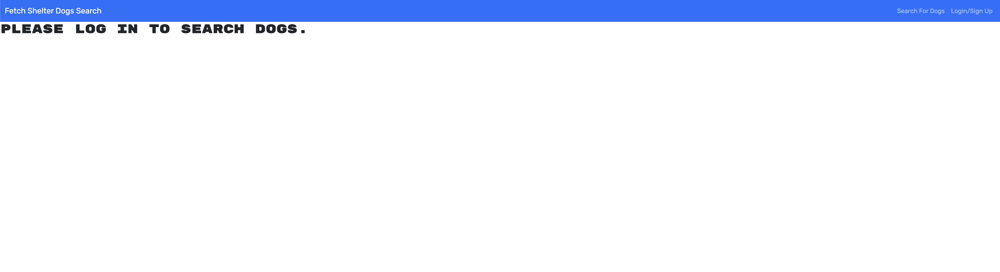
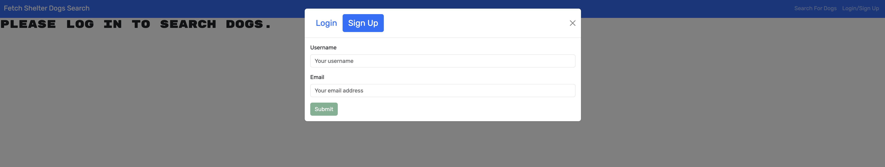
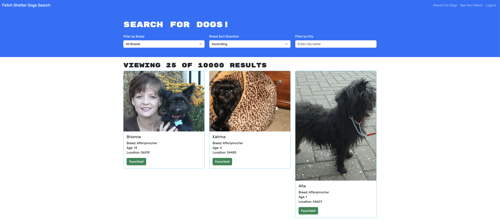
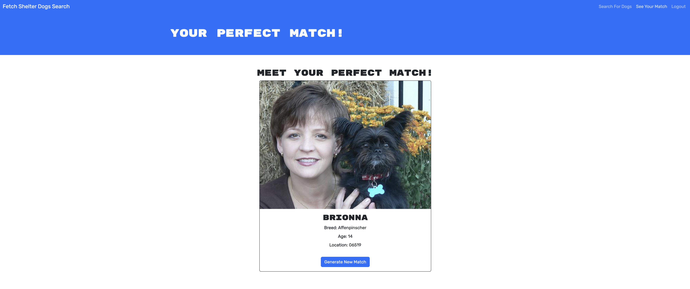

# Shelter-Dog-Finder

## Table of Contents
* [Installation](#installation)
* [Description](#description)
* [Usage](#usage)
* [Contributions](#contributions)
* [License](#license)
* [Credits](#credits)
* [Tests](#tests)
* [Questions](#questions)

## Installation
To install, please clone this repository to your computer using the following steps in Github:

1. Click the "Code" dropdown menu and copy the SSH URL.
2. Open your terminal and navigate to the directory you would like to clone this repository into.
3. Type "git clone <paste SSH URL>", replacing <paste SSH URL> with your copied SSH URL. You can substitute an SSH URL with an HTTPS URL.
4. Press enter.

## Description

This is the Shelter Dog Finder, a search engine that allows users to sort through shelter dogs and favorite the ones you connect with most. Based on your favorites, the application will automatically match you with a shelter.

This repo primarily utilizes React, TypeScript, and Bootstrap.

Users can sign up to use the app with a username and e-mail.

## Usage

After downloading, run the following commands in your terminal:

npm i 
npm run dev

Alternatively, you can access the deployed link below:

[Link to Deployed Application](https://shelter-dog-database.onrender.com/)

Once the program is running, you should see the following login page:

If you do not have an account already, click the "Sign Up" button and create an account using a username and e-mail. Otherwise, click Login to access your account.

Once you've logged in, the page will update to show two drop-down menus and an input field to help you sort through dog options. Use "Filter by Breed" to sort by breed, and "Sort Direction" to sort alphabetically in ascending or descending fashion by breed. The "Filter by City" field allows you to sort options based on specific city.

In the right hand corner of the navbar, click "See Your Match" to generate a shetler dog match! If you'd like to generate another, click "Generate New Match." If no dogs are favorited, this section will be empty.

## Contributions
When contributing to this repository, please reach out to me via e-mail to discuss the change you would like to make first. I am open to front-end and back-end updates.

## License
This project is licensed under the MIT License. For more information, please see the [MIT License](https://opensource.org/licenses/MIT).

## Credits
This program was created by Jacob McAuliffe for the UC Berkeley eDX Coding Boot Camp.

## Tests
In the future, I would love to update this application to include more ways of sorting through the dogs - name, age, etc. I'd also love to update the user profiles to allow them to be personizable, with user information including name, location, and other information pertinent to the application's dog adoption focused subject matter.

## Questions
If you have further questions, you can reach me at [mcauliffemedia@gmail.com](mailto:mcauliffemedia@gmail.com).

GitHub Account: [jacobmca](https://github.com/jacobmca)